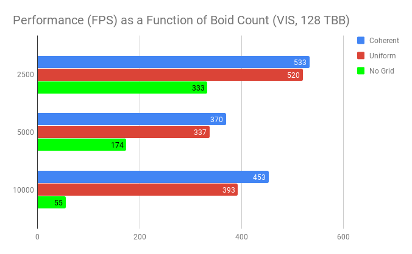
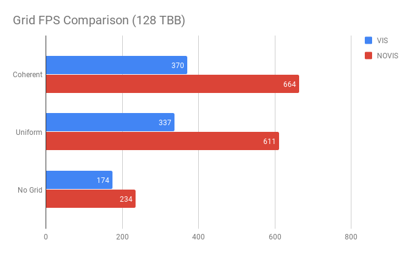
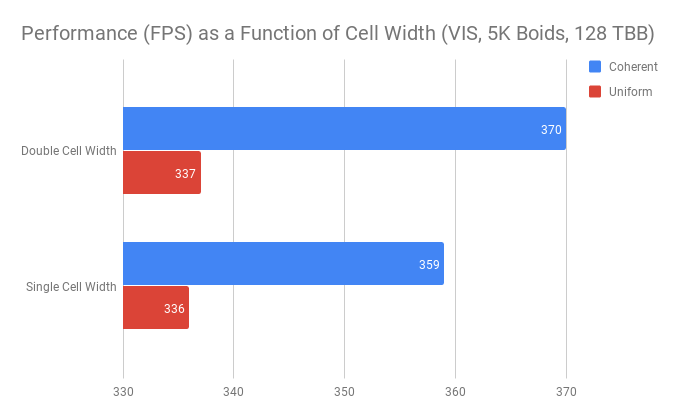
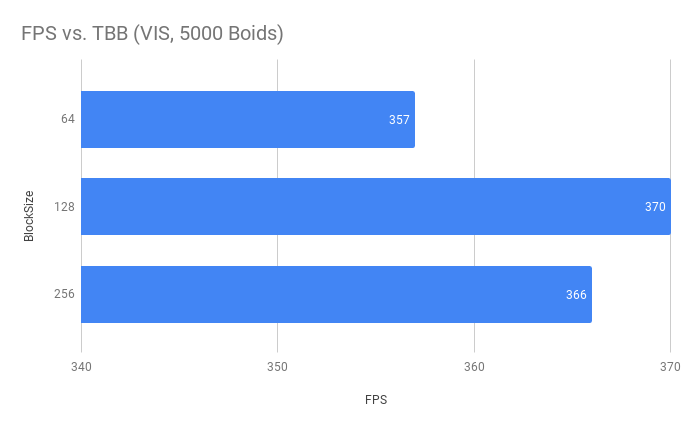
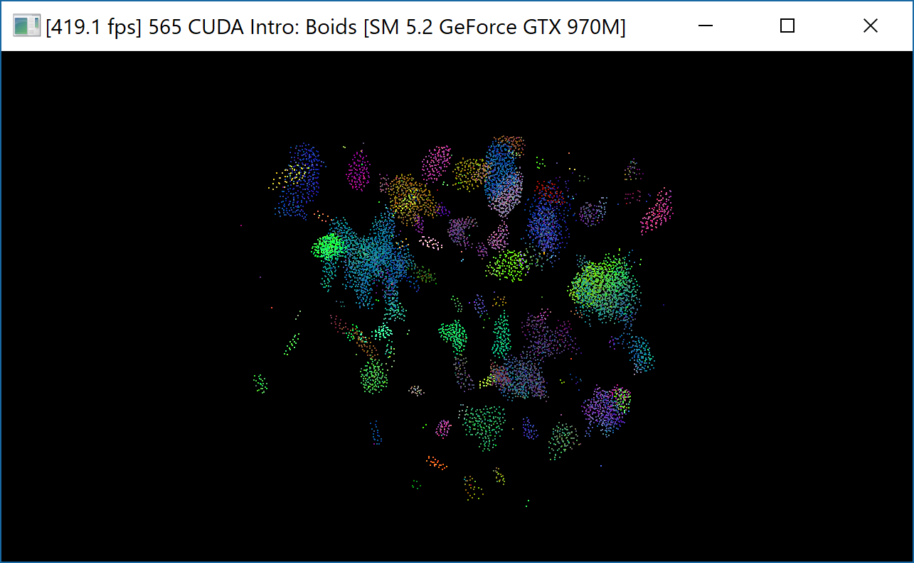

**University of Pennsylvania, CIS 565: GPU Programming and Architecture,
Project 1 - Flocking**

* Zach Corse
  * LinkedIn: https://www.linkedin.com/in/wzcorse/
  * Personal Website: https://wzcorse.com
  * Twitter: @ZachCorse
* Tested on: Windows 10, i7-6700HQ @ 2.60GHz 32GB, NVIDIA GeForce GTX 970M (personal computer)

## README

Introduction
------------

In this project I implement a standard flocking algorithm but do so on the GPU. Parallelization of flocking is possible because boid trajectory changes can be computed independently using shared position and velocity memory buffers.

A naive approach to flocking would be to compare each fish or bird (aka boid) to the other N-1 boids in the simulation. However, only the boid's nearest neighbors influence its trajectory. Therefore, this simulation includes a uniform grid optimization, in which boids are binned into cells. Each boid is then only compared to boids inside its nearest neighboring cells. I implement two nearest neighbor searches. The first assumes that each cell is twice the radius of the boid's largest flocking distance measure. This means that, in general, eight cells are scanned for neighbors in each kernel. The second assumes that each cell is equal to the radius of the boid's largest flocking distance measure. This means that, in general, 27 smaller cells are scanned for neighbors in each kernel.

I add an additional optimization to the uniform grid described above. After boids are binned into grid cells, this simulation sorts these grid cells by index and boid label simultaneously, such that by querying the index of this sorted array in a kernel, one can access a grid cell and simultaneosly ask which boid is in that grid cell. From a boid's index, one can query a separate array maintaining boid positions and velocities. The additional optimization instead sorts boid positions and velocities directly as it sorts grid cell indices, thereby eliminating the need to access an intermediary boid label array. This is known as the coherent grid.

Performance as a Function of Boid Count
------------

The most basic question one may ask about this simulation's performance is how frames per second (FPS) scales with boid (N) count. Presumably, the more boids one adds to a simulation, the lower the FPS you would expect. This is true of the naive (No Grid) approach, but the coherent and uniform grids demonstrate slightly different behavior than expected.

As the above graph indicates, there is a dip in performance when N=5000, meaning that performance actually increases with boid count immediately afterwards. This may be a consequence of how memory is allocated on the GPU, but this distribution doesn't appear to vary with GPU blocksize. 

Grid Type Comparison with and without Visualization
------------

As expected, turning off the simulation visualization dramatically increases sim FPS.

Comparing Neighborhood Search Algorithms
------------

Evaluating the Effects of Blocksize (TBB)
------------

Flocking Behavior
------------

